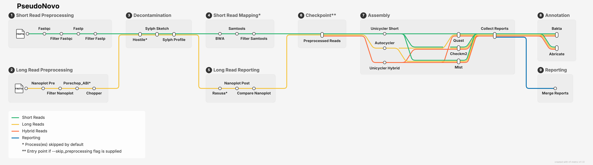

# PseudoNovo

**PseudoNovo** is a specialised ***Pseudo***monas de-***Novo*** assembly pipeline written in Nextflow. It can handle short, long or hybrid read datasets and performs read QC, assembly, assembly QC and annotation.



## Setup

1. First ensure you have [Nextflow](https://docs.seqera.io/nextflow/install#installation) installed
2. Next ensure you have either [Docker](https://docs.docker.com/engine/install/) or [Singularity](https://docs.sylabs.io/guides/3.0/user-guide/) installed
3. Clone the repo with ``git clone https://github.com/tmorr-12/PseudoNovo``
4. Download reccommended databases by running ``fetch_databases.sh`` included in this repo (optional)

> **NOTE:** If your cluster already has the required databases, you can skip step 4 and simply provide the paths to the existing databases

> **COMING SOON:** You are encouraged to provide paths to your own databases. However, if no databases are provided, the pipeline will automatically download them.

## Usage
Parameters can be passed via the command line or preferably by editing the 'qc.config' file located in this repo.

```
nextflow run main.nf --input <path/to/manifest.csv> [options]
```

## Workflow

There are 3 main workflows: **Preprocessing**, **Assembly** and **Annotation**:

**Preprocessing:**
1. Short reads are QC checked with [FastQC](https://github.com/s-andrews/fastqc) and filtered with [fastp](https://github.com/opengene/fastp). Long reads are QC checked with [Nanoplot](https://github.com/wdecoster/nanoplot), adaptors optionally trimmed with [Porechop_ABI](https://github.com/bonsai-team/Porechop_ABI), and reads filtered using [Chopper](https://github.com/wdecoster/chopper).
2. Contamination is assessed using [Sylph](https://github.com/bluenote-1577/sylph). Host reads can be optionally filtered with [Hostile](https://github.com/bede/hostile).
3. If a reference is provided, short reads are mapped using [BWA](https://github.com/bwa-mem2/bwa-mem2) and mapping QC is performed using [Samtools](https://github.com/samtools/samtools). Long reads can be optionally downsampled with [Rasusa](https://github.com/mbhall88/rasusa)
>**INFO:** You can skip preprocessing with the ``--skip_preprocessing`` flag

**Assembly:**

1. Short reads are assembled using [Unicycler](https://github.com/rrwick/unicycler), long reads are assembled using [Autocycler](https://github.com/rrwick/Autocycler). Hybrid reads are also assembled using [Unicycler](https://github.com/rrwick/unicycler)
2. Assembly QC is performed using [Quast](https://github.com/ablab/quast) and [CheckM2](https://github.com/chklovski/CheckM2). Assemblies are sequenced typed with [MLST](https://github.com/tseemann/mlst).
3. An assembly summary report is compiled and saved to the results directory
>**COMING SOON:** Long read assembly to fall back on Flye if autocycler fails. Hybrid assembly to be improved with addition of long read first methodology

**Annotation:**

1. Reads are annotated using [Bakta](https://github.com/oschwengers/bakta) and [Abricate](https://github.com/tseemann/abricate)
2. Functional annotations will be perfomed with TDB...

## Quality Control

Here is a summary of the available quality control options

### Short Read QC

| Option | Description | Default |
|---|---|---|
| fastqc_pass_criteria  | FASTQC pass criteria | "assets/fastqc_pass_criteria.json" |
| lower_assembly_length | Lower bound for assembly length when assessing read depth with fastp | 5500000 |
| min_contig_length     | Minimum contig length for assembly | 500 |
| unicycler_mode        | Unicycler mode for short reads | "normal" |
| reference             | Path to reference genome, used to map reads for additional QC | null |
| min_mapping_rate      | Threshold proportion of reads needing to map to reference during QC | 0.8 |
| max_error_rate        | Maximum error rate for short reads | 0.02 |

### Long Read QC 

| Option | Description | Default |
|---|---|---|
| long_read_platform  | "ont" or "pacbio" | "ont" |
| trim_adaptors       | Trim adaptors from long reads | false |
| minimum_phred_score | Minimum phred score for long reads | 15 |
| min_read_length     | Minimum read length for long reads | 1000 |
| downsample_reads    | Downsample long reads | false |
| target_coverage     | Target read coverage if downsampling reads | 30 |
| autocycler_subsets  | Number of subsets to use for autocycler | 4 |

### Assembly QC

| Option | Description | Default |
|---|---|---|
| min_depth| Minimum read coverage | 30 |
| target_genome_size | Assembly QC fails if genome size ±20% of target size  | 6250000 |
| target_gc_content | Assembly QC fails if genome GC content ±10% of target amount | 0.66 |
| completeness | CheckM2 min completion threshold | 99 |
| contamination | CheckM2 max contamination threshold | 5 |

## Options

You can access all options and parameters by running ``nextflow run <path/to/main.nf> --help``.

```
Usage:
    nextflow run main.nf --input manifest.csv [options]

Parameters can be passed via the command line or preferably by editing the 'qc.config' file.

Main:
    --input                             (Required) Path to input manifest, see README.md for details
    --mode                              Options: short, long, hybrid | short)
    --skip_preprocessing                Skip preprocessing step | false)
    --help                              Show this help message and exit
    --remove_host_reads                 Remove host reads from input data | false)

Databases:
    --sylph_db                          Path to sylph database (e.g. /path/to/.sylphdb)
    --checkm2_db                        Path to checkm2 database (e.g. /path/to/.dmnd)
    --bakta_db                          Path to bakta database (e.g. /path/to/database)

QC Options:
    --min_depth                         Minimum read coverage | 30)
    --target_genome_size                Assembly QC fails if genome size ±20% of target size | 6250000)
    --target_gc_content                 Assembly QC fails if genome GC content ±10% of target amount | 0.66)
    --completeness                      Threshold CheckM2 completeness score to pass QC | 99)
    --contamination                     Threshold CheckM2 contamination score to pass QC | 5)

Short Read Options:
    --fastqc_pass_criteria              Path to FASTQC pass criteria | "assets/fastqc_pass_criteria.json")
    --lower_assembly_length             Lower bound for assembly length when assessing read depth with fastp | 5500000)
    --min_contig_length                 Minimum contig length for short reads | 500)
    --unicycler_mode                    Unicycler mode for short reads | "normal")
    --reference                         Path to reference genome, used to map reads for additional QC
    --min_mapping_rate                  Threshold proportion of reads needing to map to reference during QC | 0.8)
    --max_error_rate                    Maximum error rate for short reads | 0.02)

Long Read Options:
    --long_read_platform                Platform for long reads (options: ont, pacbio) | ont)
    --trim_adaptors                     Trim adaptors from long reads | false)
    --minimum_phred_score               Minimum phred score for long reads | 15)
    --min_read_length                   Minimum read length for long reads | 1000)
    --downsample_reads                  Downsample long reads | false)
    --target_coverage                   Target read coverage if downsampling reads | 30)
    --autocycler_subsets                Number of subsets to use for autocycler | 4)
```

### Databases

For more details on the required databases, please open the following links in a new tab:
- Sylph [link](https://sylph-docs.github.io/pre%E2%80%90built-databases/)
- CheckM2 [link](https://github.com/chklovski/CheckM2#Databases)
- Bakta database [link](https://github.com/oschwengers/bakta#database)
